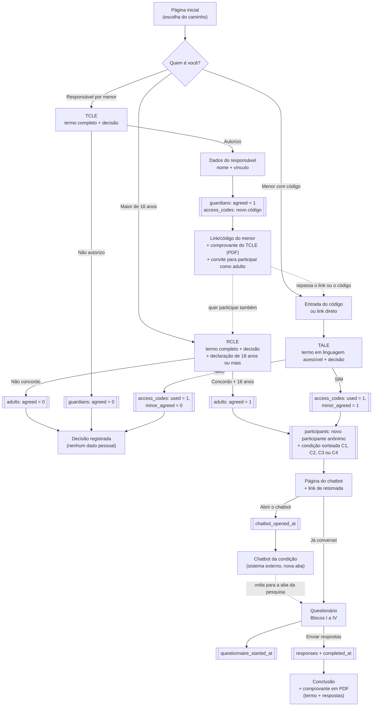
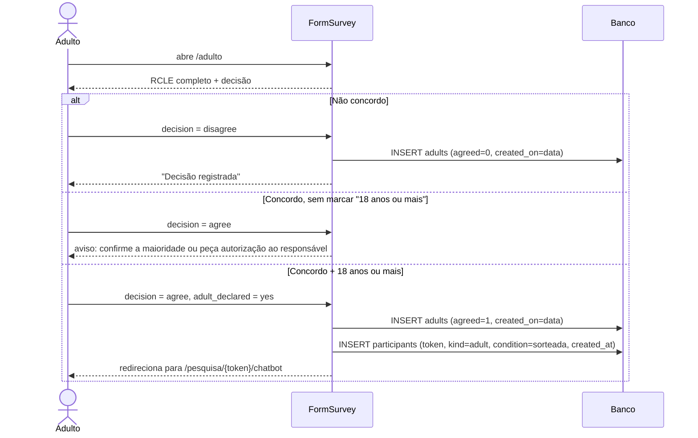
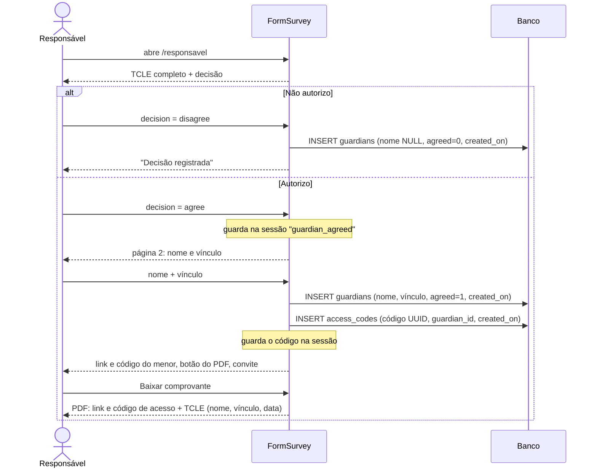
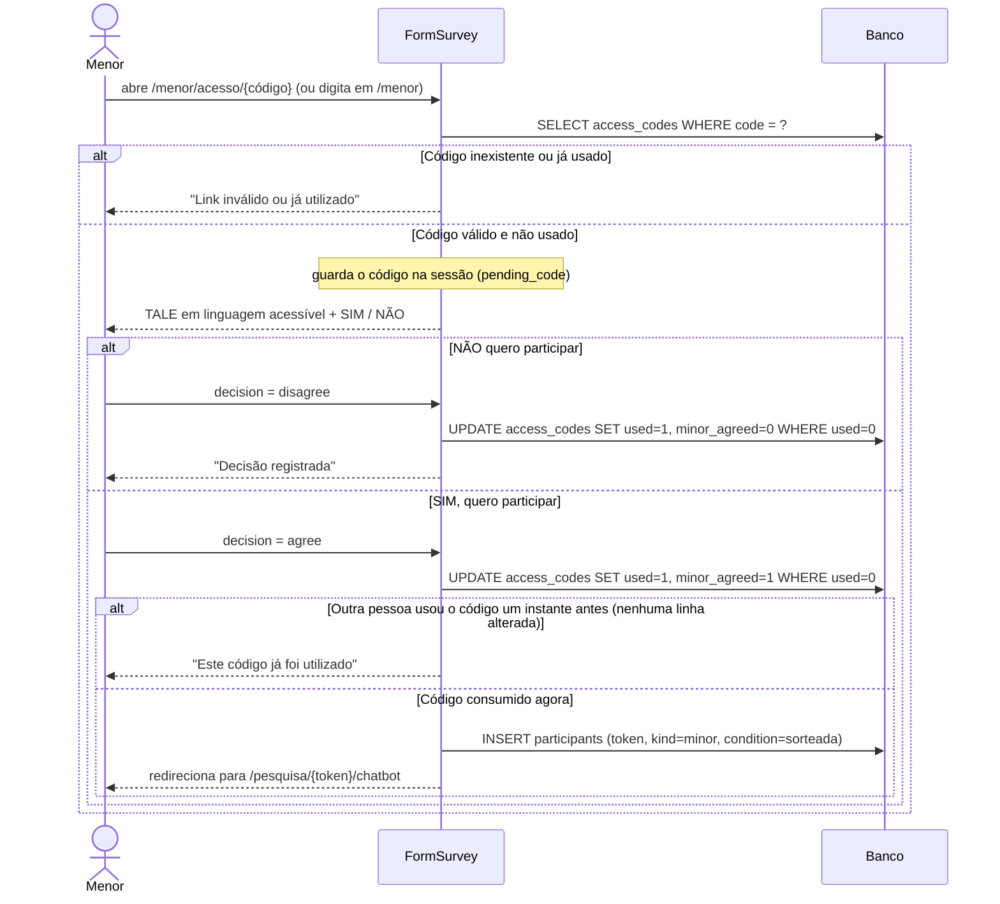
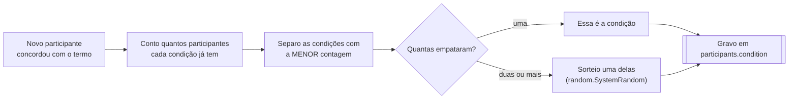
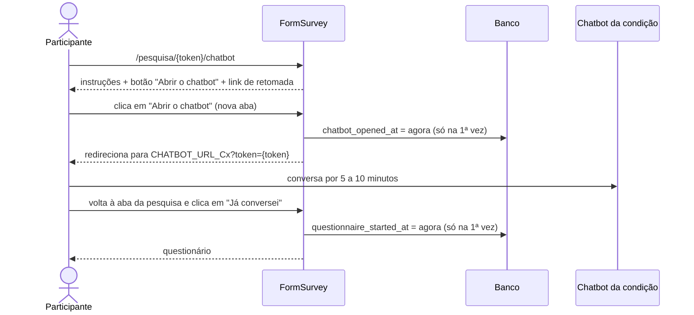
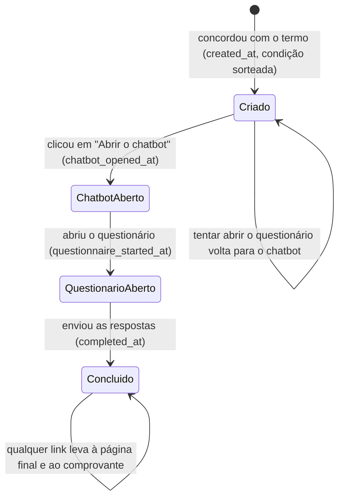
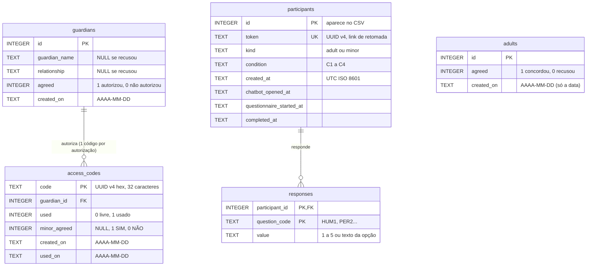
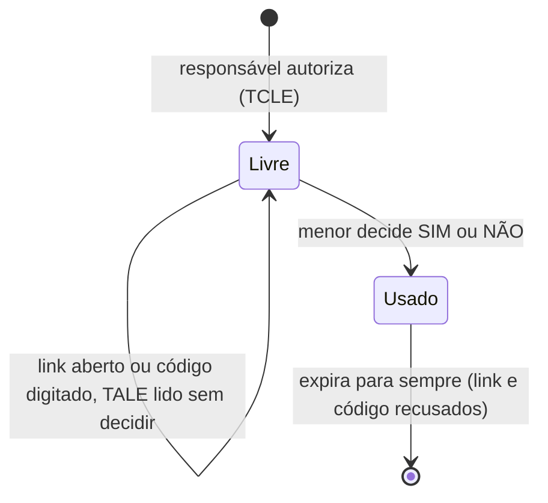
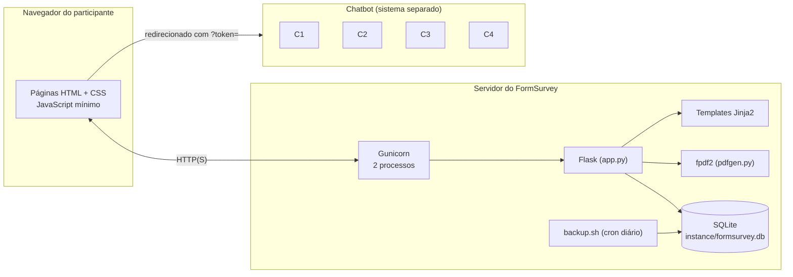

# FormSurvey

**Sistema web de consentimento eletrônico e coleta de dados para experimentos com
condições sorteadas.**

O FormSurvey reúne, em um único sistema, as etapas de uma pesquisa experimental
com seres humanos em ambiente virtual:

1. registro eletrônico do consentimento (RCLE), da autorização do responsável (TCLE)
   e do assentimento do menor (TALE), conforme as Resoluções CNS nº 466/2012 e
   nº 510/2016;
2. sorteio balanceado da condição experimental de cada participante;
3. encaminhamento ao estímulo da condição (aqui, um chatbot), com registro de ida e
   volta;
4. aplicação do questionário estruturado;
5. entrega do comprovante ao participante (PDF) e exportação dos dados, sem
   identificação, para o SPSS e o R.

Desenvolvi o FormSurvey como **Produto Técnico-Tecnológico (PTT)** da minha
dissertação no Mestrado Profissional em Gestão e Estratégia (MPGE/PPGE) da
Universidade Federal Rural do Rio de Janeiro (UFRRJ), e ele é o instrumento de
coleta da pesquisa *"Chatbot Institucional com IA na Educação Pública: um modelo
integrado entre Extended Self, Identidade Digital, TRUST-TAM e Engajamento com
Serviços Digitais"*, realizada no IFAP Campus Santana (CAAE 99324326.3.0000.0311,
CEP/UFRRJ).

- **Autor:** Wellington Furtado Damasceno — IFAP Campus Santana / PPGE-UFRRJ
- **Orientação:** Profa. Dra. Patrícia Leite (UFRRJ) · **Coorientação:** Prof. Dr. Ricardo Limongi (UFG)
- **Licença:** [GNU GPL v3.0](LICENSE) · **Como citar:** [CITATION.cff](CITATION.cff) · **Mudanças:** [CHANGELOG.md](CHANGELOG.md)

---

## Sumário

1. [Visão geral do processo](#1-visão-geral-do-processo)
2. [Etapa por etapa](#2-etapa-por-etapa)
   - [2.1 Página inicial](#21-página-inicial)
   - [2.2 Caminho do adulto (RCLE)](#22-caminho-do-adulto-rcle)
   - [2.3 Caminho do responsável (TCLE)](#23-caminho-do-responsável-tcle)
   - [2.4 Caminho do menor (TALE)](#24-caminho-do-menor-tale)
   - [2.5 Sorteio da condição experimental](#25-sorteio-da-condição-experimental)
   - [2.6 Chatbot: ida e volta](#26-chatbot-ida-e-volta)
   - [2.7 Questionário](#27-questionário)
   - [2.8 Conclusão e comprovante em PDF](#28-conclusão-e-comprovante-em-pdf)
   - [2.9 Link de retomada](#29-link-de-retomada)
3. [Painel administrativo](#3-painel-administrativo)
4. [Exportação dos dados (CSV) e codebook](#4-exportação-dos-dados-csv-e-codebook)
5. [Banco de dados](#5-banco-de-dados)
6. [Privacidade, ética e LGPD](#6-privacidade-ética-e-lgpd)
7. [Segurança](#7-segurança)
   - [Proteções do código de acesso do menor](#proteções-do-código-de-acesso-do-menor)
8. [Arquitetura e organização do código](#8-arquitetura-e-organização-do-código)
9. [Instalação, testes e operação](#9-instalação-testes-e-operação)
10. [Como adaptar para outra pesquisa](#10-como-adaptar-para-outra-pesquisa)
11. [Uso de inteligência artificial](#11-uso-de-inteligência-artificial)

---

## 1. Visão geral do processo

O diagrama abaixo mostra **todas as etapas** do sistema, para os três perfis de
participante. Cada caixa corresponde a uma página; as caixas com borda dupla são
gravações no banco de dados.



**Em resumo:** a pessoa lê o termo e decide. Se concorda, vira um *participante
anônimo* com uma condição experimental sorteada, conversa com o chatbot daquela
condição, responde ao questionário e baixa o comprovante. Quem recusa, em qualquer
ponto, sai sem informar nenhum dado pessoal.

### As rotas (endereços) do sistema

| Etapa | Endereço | Método | O que faz |
|---|---|---|---|
| Início | `/` | GET | Apresenta a pesquisa e os três caminhos |
| Recusa | `/nao-participacao` | GET | Agradece e encerra |
| Adulto | `/adulto` | GET/POST | RCLE + decisão + declaração de maioridade |
| Responsável | `/responsavel` | GET/POST | TCLE + decisão |
| Responsável | `/responsavel/detalhes` | GET/POST | Nome e vínculo; gera o código do menor |
| Responsável | `/responsavel/codigo` | GET | Link/código do menor e convite |
| Responsável | `/responsavel/comprovante.pdf` | GET | PDF do TCLE |
| Menor | `/menor` | GET/POST | Digitar o código |
| Menor | `/menor/acesso/<código>` | GET | Link direto (ativa o código) |
| Menor | `/menor/assentimento` | GET/POST | TALE + decisão |
| Pesquisa | `/pesquisa/<token>/chatbot` | GET | Instruções + link de retomada |
| Pesquisa | `/pesquisa/<token>/chatbot/abrir` | GET | Registra a abertura e redireciona ao chatbot da condição |
| Pesquisa | `/pesquisa/<token>/questionario` | GET/POST | Questionário |
| Pesquisa | `/pesquisa/<token>/concluido` | GET | Agradecimento + botão do comprovante |
| Pesquisa | `/pesquisa/<token>/comprovante.pdf` | GET | PDF do termo + respostas |
| Pesquisador | `/admin/login`, `/admin/logout` | GET/POST | Entrada e saída do painel |
| Pesquisador | `/admin` | GET | Painel com números agregados |
| Pesquisador | `/admin/exportar/respostas.csv` | GET | CSV para SPSS/R |

---

## 2. Etapa por etapa

Para cada etapa descrevo **o que o participante vê**, **o que o sistema grava** e
**por que** fiz assim. O código correspondente está em [`app.py`](app.py), na mesma
ordem, com comentários explicando cada decisão.

### 2.1 Página inicial

**Rota:** `/` · **Template:** [`templates/index.html`](templates/index.html)

O participante vê o título da pesquisa, um resumo visual das etapas (Termo → Chatbot →
Questionário → Comprovante) e três botões:

- *Sou responsável e quero autorizar um(a) menor de idade a participar*;
- *Sou maior de 18 anos e quero participar da pesquisa*;
- *Sou menor de idade e já tenho um código de acesso*.

**Nada é gravado.** A escolha do botão só define qual termo a pessoa vai ler.

### 2.2 Caminho do adulto (RCLE)

**Rota:** `/adulto` · **Template:** [`templates/adult_consent.html`](templates/adult_consent.html)



**O que a pessoa vê:** o texto integral do RCLE aprovado pelo CEP, dividido em
seções com ícones (objetivo, procedimentos, riscos, benefícios, participação
voluntária, sigilo, remuneração, contatos e CAAE). No fim, a declaração do termo, a
caixa *"Declaro que tenho 18 anos ou mais"* e os botões *Concordo* / *Não concordo*.

**O que é gravado:**
- na tabela `adults`, só a decisão (`agreed` = 1 ou 0) e a **data** (sem hora);
- se concordou, uma linha nova em `participants`, com um token aleatório e a condição
  sorteada (seção [2.5](#25-sorteio-da-condição-experimental)).

**Por quê:**
- *Nenhum dado pessoal é pedido.* O RCLE promete que "não serão coletados nome, CPF,
  e-mail ou matrícula". Por isso não existe uma página "seus dados" para o adulto.
- *A declaração de maioridade* impede que um menor entre pelo caminho errado, sem a
  autorização do responsável que a pesquisa exige. Ela só é exigida de quem concorda:
  quem recusa não precisa declarar nada. O navegador bloqueia o envio sem a marcação
  (`required`), e o servidor confere de novo, porque a validação do navegador pode ser
  contornada.
- *Termo e decisão na mesma página:* a pessoa não consegue decidir sem ter o termo
  inteiro à frente.

### 2.3 Caminho do responsável (TCLE)

**Rotas:** `/responsavel` → `/responsavel/detalhes` → `/responsavel/codigo` ·
**Templates:** `guardian_consent.html`, `guardian_details.html`, `guardian_code.html`



**O que a pessoa vê:**
1. **Página 1:** o TCLE completo e os botões *Autorizo a participação* / *Não autorizo*.
2. **Página 2 (só se autorizou):** dois campos, *seu nome* e *grau de parentesco ou
   vínculo com o(a) menor*.
3. **Página 3:** o **link de acesso** do menor (com botão *Copiar*), o **código** de 32
   caracteres (para quem prefere passar por telefone), o botão **Baixar comprovante
   (PDF)**, que também traz o link e o código, e o convite *"Quer participar também?
   Participe como adulto"*.

**O que é gravado:** em `guardians`, o nome, o vínculo, a decisão e a data; em
`access_codes`, um código novo ligado a essa autorização.

**Por quê:**
- *Decisão antes dos dados:* quem não autoriza não informa nada. O nome só é pedido
  depois do "Autorizo", e uma marca na sessão impede pular direto para a página 2.
- *O nome do responsável e o vínculo* são o equivalente eletrônico da assinatura do
  TCLE: registram **quem** autorizou.
- *O nome do menor não é pedido.* O TCLE promete que "não serão coletados nome, CPF,
  e-mail ou matrícula do(a) menor". O menor é identificado, no comprovante do
  responsável, pelo código de acesso, e o responsável sabe a quem entregou cada código.
- *O comprovante é baixado na hora*, e não enviado por e-mail, para não precisar
  guardar o e-mail de ninguém. Ele só pode ser baixado na mesma sessão em que a
  autorização foi feita.
- *O link e o código de acesso também vão no PDF*, logo no início do documento. A
  página que os mostra depende da sessão do navegador: se o responsável a fechasse sem
  copiar o link, o acesso se perderia e ele precisaria autorizar de novo. Com o PDF
  salvo, ele pode repassar o acesso depois, com calma. O PDF avisa que o acesso é de
  uso único e que não deve ser compartilhado com outras pessoas.
- *Se o responsável quiser responder à pesquisa*, ele passa pelo **RCLE**, como
  qualquer adulto. O TCLE autoriza a participação **do menor**; quem participa por si
  mesmo precisa consentir com o termo próprio para isso. Por esse caminho, o
  responsável também participa sem nenhum dado pessoal ligado às respostas.
- *Cada autorização gera um código.* Quem tem dois filhos participantes autoriza duas
  vezes e recebe dois códigos.

### 2.4 Caminho do menor (TALE)

**Rotas:** `/menor/acesso/<código>` (link) ou `/menor` (digitar o código) →
`/menor/assentimento` · **Templates:** `minor_code_entry.html`, `minor_consent.html`



**O que a pessoa vê:** uma saudação, o TALE completo (com visual mais leve e colorido,
pensado para estudantes de 14 a 17 anos) e os botões *SIM, quero participar!* /
*NÃO quero participar*.

**O que é gravado:** na própria linha do código, em `access_codes`, que ele foi usado
(`used = 1`), a decisão do menor (`minor_agreed`) e a data. Se o menor disse SIM, uma
linha nova em `participants`.

**Por quê:**
- *A sequência TCLE → TALE é obrigatória.* O TALE só abre com um código gerado por
  uma autorização, e o código fica preso a essa autorização (`guardian_id`).
- *A decisão final é do menor.* O texto do TALE diz "a decisão final é SUA", e o
  sistema respeita isso: mesmo com o código, o menor pode dizer NÃO.
- *O código é de uso único e é gasto na decisão*, seja SIM ou NÃO, e não ao abrir a
  página. Assim o menor pode abrir o link, ler com calma, fechar e voltar depois sem
  perder o código. Mas, depois de decidir, o código **expira para sempre**: ele e o
  link de acesso (inclusive o que está no PDF do responsável) deixam de funcionar.
  Ninguém consegue reaproveitá-lo, nem para mudar a decisão, nem para outra pessoa
  participar no lugar do menor.
- *O uso único é garantido pelo banco de dados.* O código é marcado como usado em uma
  única operação, que só tem efeito se ele ainda estiver livre (`UPDATE ... WHERE
  used = 0`). Se duas pessoas abrirem o mesmo link e clicarem em SIM quase no mesmo
  instante, só a primeira entra; a segunda recebe "Este código já foi utilizado".
  Sem isso, as duas poderiam passar pela checagem antes de qualquer uma gravar.
- *O código é um UUID v4* (122 bits aleatórios, 32 caracteres hexadecimais). Não dá
  para adivinhar o código de outra pessoa testando sequências, como seria com 1, 2, 3...
- *O menor não informa nada além da decisão.*

### 2.5 Sorteio da condição experimental

**Função:** `assign_condition()` em [`app.py`](app.py) · **Configuração:** `CONDITIONS` em [`config.py`](config.py)

A pesquisa usa um **delineamento fatorial 2x2 entre sujeitos**: cada participante é
exposto a **uma** de quatro versões do chatbot, que combinam dois fatores em dois
níveis.

| Condição | Humanização (`hum`) | Personalização institucional (`per`) | Descrição |
|---|---|---|---|
| **C1** | baixa (0) | baixa (0) | Linguagem neutra e objetiva; interface genérica |
| **C2** | alta (1) | baixa (0) | Linguagem cordial e próxima; interface genérica |
| **C3** | baixa (0) | alta (1) | Linguagem neutra; identidade visual e termos do IFAP |
| **C4** | alta (1) | alta (1) | Linguagem cordial + identidade do IFAP |

O sorteio acontece **no momento em que o participante concorda com o termo** (adulto
ou menor), dentro de `new_participant()`. Ele é **balanceado**:



**Exemplo:** se as contagens estão em C1 = 5, C2 = 4, C3 = 4 e C4 = 5, o próximo
participante vai para C2 ou C3, sorteado entre as duas. Assim, a diferença entre o
maior e o menor grupo nunca passa de 1.

**Por quê:**
- *Balanceado e não um sorteio simples:* a ANOVA 2x2 da dissertação pede de 40 a 50
  participantes por célula. Com um sorteio simples (cada pessoa com 25% de chance para
  cada grupo), 200 participantes poderiam terminar em 60/45/52/43, por puro acaso. O
  balanceamento elimina esse risco, e o desempate aleatório impede que a ordem de
  chegada decida o grupo.
- *Conto todos os sorteados, não só quem concluiu:* quem está respondendo agora já
  ocupa a vaga da sua condição. Se eu contasse só os concluídos, várias pessoas que
  chegassem ao mesmo tempo iriam todas para o mesmo grupo. A desistência por condição
  aparece no painel (seção [3](#3-painel-administrativo)).
- *`random.SystemRandom`:* usa a aleatoriedade do sistema operacional, que não pode
  ser prevista. O gerador padrão do Python é previsível se a semente for conhecida.
- *O participante não escolhe nem vê a lista de condições.* Ele só recebe o endereço
  do chatbot da sua.

### 2.6 Chatbot: ida e volta

**Rotas:** `/pesquisa/<token>/chatbot` e `/pesquisa/<token>/chatbot/abrir` ·
**Template:** `chatbot.html`

O chatbot é um **sistema separado** (outro produto da pesquisa). O FormSurvey não
conversa com ele; apenas encaminha o participante e registra os horários.



**O que a pessoa vê:** instruções (*"faça uma breve simulação de atendimento, de 5 a 10
minutos"*), o botão **Abrir o chatbot**, que abre em nova aba, e o **link de retomada**
com botão *Copiar*. O botão *Já conversei, continuar para o questionário* só aparece
depois que o chatbot foi aberto.

**O contrato de integração com o chatbot** (vale para qualquer chatbot ou estímulo):

| Item | Valor |
|---|---|
| Endereço de cada condição | `CHATBOT_URL_C1` ... `CHATBOT_URL_C4` no `.env` |
| O que o FormSurvey envia | `?token=<UUID do participante>` no fim do endereço (ou `&token=` se o endereço já tiver `?`) |
| Para que serve o token | Se o chatbot gravar as conversas, pode associá-las ao participante anônimo e, portanto, à condição, sem nenhum dado pessoal |
| Como o participante volta | Pela aba do FormSurvey, que continua aberta. O chatbot não precisa saber o endereço de volta |

**Por quê:**
- *Passar por `/abrir` em vez de ligar direto ao chatbot* permite (1) registrar o
  horário de exposição ao estímulo, que comprova que ela aconteceu, e (2) não mostrar
  na página os endereços das quatro versões.
- *O questionário só abre depois que o chatbot foi aberto:* responder sobre um chatbot
  que não se viu invalidaria a resposta para o experimento. A trava existe no
  servidor; esconder o botão é só conforto visual.
- *Registrar só a primeira abertura:* se a pessoa clicar de novo, o horário inicial
  não muda.
- *Limitação conhecida:* o FormSurvey registra que o chatbot foi **aberto**, não
  quanto a pessoa **conversou**. O tempo entre abrir o chatbot e abrir o questionário
  (`seg_chatbot` no CSV) é uma aproximação. A medida exata, se necessária, vem dos
  registros do próprio chatbot, cruzados pelo token.

### 2.7 Questionário

**Rota:** `/pesquisa/<token>/questionario` · **Definição dos itens:** [`questions.py`](questions.py) ·
**Template:** `questionnaire.html`

O instrumento é o Anexo I da dissertação. Ele tem quatro blocos e 40 itens:

| Bloco | Construto | Código | Itens | Formato |
|---|---|---|---|---|
| I — Verificação da manipulação | Humanização da Interface | `HUM1`–`HUM4` | 4 | Likert 1–5 |
| | Personalização Institucional | `PER1`–`PER4` | 4 | Likert 1–5 |
| II — Construtos do modelo | Identidade Digital Institucional Percebida | `IDI1`–`IDI4` | 4 | Likert 1–5 |
| | Confiança em Inteligência Artificial | `CON1`–`CON4` | 4 | Likert 1–5 |
| | Utilidade Percebida | `PU1`–`PU4` | 4 | Likert 1–5 |
| | Facilidade de Uso Percebida | `PEOU1`–`PEOU4` | 4 | Likert 1–5 |
| | Intenção de Uso | `IU1`–`IU4` | 4 | Likert 1–5 |
| | Engajamento de Serviços Digitais | `CSD1`–`CSD4` | 4 | Likert 1–5 |
| III — Controle | Variáveis de Controle | `VC1`–`VC3` | 3 | Likert 1–5 |
| IV — Perfil | Vínculo, faixa etária, gênero, escolaridade, frequência de uso | `VINCULO`, `FAIXA_ETARIA`, `GENERO`, `ESCOLARIDADE`, `FREQUENCIA` | 5 | Múltipla escolha |

A escala Likert é: **1** Discordo Totalmente · **2** Discordo Parcialmente · **3** Neutro ·
**4** Concordo Parcialmente · **5** Concordo Totalmente. O texto de cada item está no
[codebook](dados/codebook.csv) e em [`questions.py`](questions.py).

**O que é gravado:** uma linha em `responses` por item respondido (código do item e
valor), o horário em que o questionário foi aberto pela primeira vez
(`questionnaire_started_at`) e o horário de envio (`completed_at`).

**Por quê:**
- *Nenhum item é obrigatório.* Os termos garantem o "direito de não responder a
  qualquer questão sem necessidade de justificativa". Item em branco não gera linha, e
  o CSV informa quantos ficaram em branco (`itens_em_branco`), para servir de filtro
  na análise.
- *O servidor só aceita valores que existem no instrumento* (1 a 5 nos itens Likert,
  as opções listadas no perfil). Qualquer outro valor, enviado por alguém que editou o
  formulário no navegador, é descartado, como se o item estivesse em branco.
- *O questionário é definido como dados (`questions.py`), não escrito no HTML:* uma
  única definição alimenta a página, a validação, o PDF, o CSV, o codebook e o painel.
- *Os códigos curtos (HUM1, PER2...)* viram os nomes das colunas no CSV, prontos para
  o SPSS e o R, e o prefixo identifica o construto.
- *Responder uma vez só:* depois do envio, o mesmo link leva à página de conclusão, e
  não ao questionário de novo.

### 2.8 Conclusão e comprovante em PDF

**Rotas:** `/pesquisa/<token>/concluido` e `/pesquisa/<token>/comprovante.pdf` ·
**Gerador:** [`pdfgen.py`](pdfgen.py)

A página final agradece e oferece o botão **Baixar comprovante (PDF)**. O PDF contém:

- o **texto integral do termo aceito** (RCLE para adulto, TALE para menor);
- os **dados do registro**: a decisão, a declaração de maioridade (adulto) e a
  data/hora do aceite;
- **as respostas dadas**: cada item seguido da resposta marcada, por exemplo
  *"Resposta: 4 - Concordo Parcialmente"*.

O comprovante do **responsável** (seção 2.3) traz, no início, o link e o código de
acesso do menor, com o aviso de que o acesso é de uso único; em seguida, o TCLE, o
nome, o vínculo e a data.

**Por quê:**
- A Resolução CNS nº 510/2016 e o Ofício Circular nº 2/2021/CONEP orientam que o
  participante de pesquisa em ambiente virtual receba uma cópia do registro de
  consentimento.
- *Baixar em vez de receber por e-mail:* o envio por e-mail exigiria guardar o e-mail,
  que os termos prometem não coletar, e ligá-lo às respostas. O download entrega a
  cópia sem que o sistema precise saber quem a pessoa é.
- *O PDF é gerado na hora* e não fica gravado em lugar nenhum. O participante pode
  baixá-lo de novo enquanto tiver o link de retomada.
- *O texto vem do mesmo `terms.py` da tela:* o que o participante leu e o que está no
  comprovante são exatamente iguais.

### 2.9 Link de retomada

A partir do momento em que a pessoa concorda, todas as páginas da pesquisa levam o
**token** no endereço: `/pesquisa/<token>/...`. O token é um UUID v4, sorteado e
impossível de adivinhar. Ele funciona como um *link de retomada*: se a internet cair,
o celular desligar ou a pessoa trocar de aparelho, basta abrir o mesmo link para
continuar exatamente de onde parou. A página do chatbot mostra esse link com um botão
*Copiar*.



**Regras:** token inexistente gera página 404; participante que já concluiu é sempre
levado à página final, e não consegue responder de novo.

**Limitação aceita:** o link é pessoal, mas quem o recebe pode repassá-lo. Como em
qualquer link de convite, isso não tem solução técnica sem pedir identificação, e
pedir identificação contrariaria os termos. A página avisa: *"ele é pessoal, não
compartilhe"*.

---

## 3. Painel administrativo

**Rota:** `/admin` (com senha) · **Cálculos:** [`stats.py`](stats.py) · **Template:** `admin_dashboard.html`

O painel serve para **acompanhar a coleta enquanto ela acontece**. Ele mostra só
números agregados, nunca uma linha individual:

| Quadro | O que mostra | Para que serve |
|---|---|---|
| Termos: adesão e recusa | Concordaram/recusaram em cada termo; códigos de menor ainda não usados | Acompanhar a taxa de adesão e os menores autorizados que ainda não entraram |
| Condições experimentais | Por condição: sorteados, abriram o chatbot, concluíram | Conferir o balanceamento e ver em qual condição há mais desistência |
| Médias por construto | Média geral (1 a 5) de cada construto, em barras | Visão geral das respostas |
| Médias por construto e condição | Tabela construto × condição | Acompanhar a verificação da manipulação: espera-se HUM maior em C2 e C4 e PER maior em C3 e C4 |
| Bloco IV — Perfil | Distribuição de cada pergunta de perfil, em % | Conferir a composição da amostra |

**Por quê:** as barras são feitas só com CSS (a largura é proporcional ao valor), sem
biblioteca de gráficos e sem nada carregado de sites externos. A tabela por condição é
uma checagem rápida durante a coleta, e não substitui o teste estatístico, que é feito
no SPSS.

O acesso usa uma senha única, definida no `.env` (`ADMIN_PASSWORD`). Veja a seção
[7](#7-segurança).

---

## 4. Exportação dos dados (CSV) e codebook

**Rota:** `/admin/exportar/respostas.csv` (exige o login do painel; há um link
**Exportar CSV** no menu) · **Código:** `export_csv()` e `export_columns_dictionary()` em [`app.py`](app.py)

O CSV tem **uma linha por participante que concluiu** e 53 colunas:

| Coluna | Conteúdo |
|---|---|
| `participante` | Número sequencial (1, 2, 3...). Não identifica a pessoa |
| `perfil` | `adulto` (RCLE) ou `menor` (TCLE + TALE) |
| `condicao` | `C1`, `C2`, `C3` ou `C4` |
| `hum`, `per` | Os fatores da condição, em 0/1, prontos para a ANOVA 2x2 |
| `inicio`, `chatbot_aberto`, `questionario_aberto`, `concluido` | Horários de cada etapa (UTC, ISO 8601) |
| `seg_chatbot` | Segundos entre abrir o chatbot e abrir o questionário (tempo aproximado de interação) |
| `seg_questionario` | Segundos entre abrir e enviar o questionário |
| `seg_total` | Segundos do aceite do termo ao envio |
| `itens_em_branco` | Quantos dos 40 itens ficaram sem resposta |
| `HUM1` ... `FREQUENCIA` | As 40 respostas (1 a 5 nos itens Likert; o texto da opção no perfil; vazio = não respondeu) |

O **[codebook](dados/codebook.csv)** descreve cada coluna: nome, descrição, tipo e
valores possíveis. Ele é **gerado pelo próprio sistema**, a partir do mesmo código que
gera o CSV, e por isso nunca fica diferente do arquivo exportado:

```bash
flask --app app codebook > dados/codebook.csv
```

**Por quê:**
- *Número sequencial, e não o token:* o token é o link de retomada do participante. Se
  ele aparecesse no CSV, qualquer pessoa com a planilha poderia abrir a pesquisa no
  lugar do participante.
- *`hum` e `per` em 0/1:* a ANOVA 2x2 usa os dois fatores diretamente, sem recodificar.
- *Os horários e as durações* permitem descartar respostas rápidas demais (por exemplo,
  `seg_questionario` muito baixo para 40 itens) e conferir se houve tempo real de
  interação com o chatbot.
- *Exige login:* antes a exportação usava um token na própria URL, que ficava no
  histórico do navegador e nos logs do servidor. Agora segue a mesma regra das outras
  páginas do pesquisador.
- *O arquivo começa com BOM UTF-8:* o Excel abre os acentos corretamente; SPSS e R
  ignoram o BOM.

**Abrindo os dados:**

- **SPSS:** *Arquivo → Importar dados → Dados CSV*, codificação UTF-8.
- **R:**

  ```r
  dados <- read.csv("respostas_pesquisa.csv", fileEncoding = "UTF-8-BOM")

  # Exemplo: média do construto IDI e ANOVA 2x2 (humanização x personalização)
  dados$IDI <- rowMeans(dados[, c("IDI1", "IDI2", "IDI3", "IDI4")], na.rm = TRUE)
  summary(aov(IDI ~ factor(hum) * factor(per), data = dados))
  ```

---

## 5. Banco de dados

O banco é um único arquivo SQLite (`instance/formsurvey.db`). A estrutura completa,
com comentários, está em [`schema.sql`](schema.sql).

### 5.1 Diagrama



Repare que há **dois grupos de tabelas que não se ligam**:

| Grupo | Tabelas | Guarda |
|---|---|---|
| **Registros de consentimento** | `adults`, `guardians`, `access_codes` | A decisão diante de cada termo e, no caso do responsável, o nome e o vínculo |
| **Dados da pesquisa** | `participants`, `responses` | A condição, os horários e as respostas, **sem nenhuma referência** ao grupo de cima |

### 5.2 Dicionário das tabelas

**`adults`**: uma linha por adulto que decidiu diante do RCLE.

| Coluna | Tipo | Descrição |
|---|---|---|
| `id` | inteiro | Identificador interno |
| `agreed` | 0/1 | 1 = concordou; 0 = recusou |
| `created_on` | texto | Data da decisão (AAAA-MM-DD), sem hora |

**`guardians`**: uma linha por responsável que decidiu diante do TCLE.

| Coluna | Tipo | Descrição |
|---|---|---|
| `id` | inteiro | Identificador interno |
| `guardian_name` | texto | Nome do responsável (vazio quando não autorizou) |
| `relationship` | texto | Vínculo com o menor, ex.: mãe, avó (vazio quando não autorizou) |
| `agreed` | 0/1 | 1 = autorizou; 0 = não autorizou |
| `created_on` | texto | Data da decisão |

**`access_codes`**: o código de uso único do menor, que também registra o assentimento.

| Coluna | Tipo | Descrição |
|---|---|---|
| `code` | texto | Código UUID v4 em hexadecimal (32 caracteres) |
| `guardian_id` | inteiro | Autorização que gerou este código (→ `guardians.id`) |
| `used` | 0/1 | 0 = ainda não usado; 1 = o menor já decidiu |
| `minor_agreed` | 0/1/vazio | Decisão do menor no TALE: 1 = SIM, 0 = NÃO, vazio = ainda não decidiu |
| `created_on` | texto | Data da autorização |
| `used_on` | texto | Data do assentimento |

**`participants`**: uma linha por pessoa que entrou na pesquisa (adulto ou menor que concordou).

| Coluna | Tipo | Descrição |
|---|---|---|
| `id` | inteiro | Número sequencial; é o `participante` do CSV |
| `token` | texto | UUID v4 secreto, usado no link de retomada; nunca sai no CSV |
| `kind` | texto | `adult` ou `minor` |
| `condition` | texto | Condição sorteada (C1 a C4) |
| `created_at` | data-hora | Aceite do termo (UTC) |
| `chatbot_opened_at` | data-hora | Primeira abertura do chatbot |
| `questionnaire_started_at` | data-hora | Primeira abertura do questionário |
| `completed_at` | data-hora | Envio do questionário (vazio = não concluiu) |

**`responses`**: uma linha por item respondido.

| Coluna | Tipo | Descrição |
|---|---|---|
| `participant_id` | inteiro | → `participants.id` |
| `question_code` | texto | Código do item (`HUM1`, `VINCULO`...) |
| `value` | texto | Valor marcado (`1` a `5`, ou o texto da opção) |

### 5.3 Exemplo: o que fica gravado quando um menor participa

Maria autoriza o filho; no dia seguinte ele entra pelo link, diz SIM e responde a três
itens:

```text
guardians      id=12  guardian_name="Maria Silva"  relationship="Mãe"  agreed=1  created_on=2026-10-20
access_codes   code="3f2a...c91e"  guardian_id=12  used=1  minor_agreed=1  created_on=2026-10-20  used_on=2026-10-21

participants   id=57  token="9b1e...-..."  kind="minor"  condition="C3"
               created_at="2026-10-21T14:02:11+00:00"  chatbot_opened_at="2026-10-21T14:02:40+00:00"
               questionnaire_started_at="2026-10-21T14:10:05+00:00"  completed_at="2026-10-21T14:19:52+00:00"
responses      (57, "HUM1", "2")   (57, "PER1", "5")   (57, "VINCULO", "Estudante")
```

Nada em `participants` ou `responses` aponta para a linha da Maria nem para o código.
O sistema sabe que **alguém** autorizado pela Maria assentiu em 21/10 e que o
participante 57 é um menor, mas **não tem nenhuma coluna** que diga que o 57 é o
filho da Maria.

### 5.4 Mudanças de estrutura

As tabelas são criadas com `CREATE TABLE IF NOT EXISTS`. Rodar `flask --app app
init-db` de novo **não apaga nada**, mas também não altera tabelas que já existem.
Se a estrutura mudar entre versões (como da 0.1 para a 0.9), o banco precisa ser
recriado. Isso só pode ser feito **antes do início da coleta**; veja o
[CHANGELOG](CHANGELOG.md) e o [INSTALL.md](INSTALL.md).

---

## 6. Privacidade, ética e LGPD

### 6.1 O que é coletado de cada pessoa

| Pessoa | Dados de identificação | Dados da pesquisa |
|---|---|---|
| Adulto | **Nenhum** (só a decisão e a data) | Condição, horários, respostas |
| Responsável | Nome e vínculo com o menor (a "assinatura" do TCLE) | Nenhum. Se quiser responder, participa como adulto |
| Menor | **Nenhum** (só a decisão e a data, no código) | Condição, horários, respostas |
| Quem recusa | **Nenhum** (só a recusa e a data) | Nenhum |

Não são coletados: nome do participante, nome do menor, e-mail, CPF, matrícula,
telefone, endereço IP (o sistema não grava IP no banco) nem localização.

### 6.2 Como as respostas ficam separadas da identidade

1. **Nenhuma chave liga os dois grupos de tabelas** (seção [5.1](#51-diagrama)). Na
   versão 0.1 havia uma coluna `participants.ref_id` que apontava para o registro de
   consentimento, e bastava um JOIN para ligar as respostas ao nome. Ela foi removida.
2. **Os registros de consentimento guardam só a data, sem hora.** Se eles tivessem a
   hora exata, daria para casá-los com `participants.created_at`, que é criado no
   mesmo segundo. Com só a data, cada registro se mistura com todos os outros do mesmo
   dia.
3. **O assentimento do menor fica na linha do código**, criada no dia da autorização
   do responsável, e não em uma tabela própria preenchida junto com o participante.
   Assim a ordem de inserção das linhas também não liga uma coisa à outra.
4. **O CSV não tem token, nome nem código**, só o número sequencial do participante.
5. **Há um teste automático** (`test_research_data_is_not_linked_to_consent_records`)
   que falha se alguém voltar a criar uma ligação entre as tabelas ou a gravar hora
   nos registros de consentimento.

### 6.3 Pseudonimização, e não anonimização

Pelo rigor da LGPD (Lei nº 13.709/2018, art. 13, § 4º), o tratamento acima é
**pseudonimização**: os dados da pesquisa não contêm identificação e não estão ligados
a ela, mas os registros de consentimento existem no mesmo servidor. Em um caso
extremo, por exemplo, um único menor participando em um dia em que um único
responsável autorizou, alguém com acesso ao **banco inteiro** poderia inferir a
ligação pelas datas. Esse risco residual é baixo e fica restrito a quem tem acesso
administrativo ao servidor, que é só o pesquisador.

**Sugestão de redação para a dissertação (seção 3.4.1):** "os dados pessoais
necessários ao registro do consentimento são armazenados em tabelas específicas, sem
qualquer chave que os relacione às respostas, que são vinculadas exclusivamente a um
identificador aleatório (UUID v4). Os registros de consentimento guardam apenas a data
da decisão, e o arquivo de análise não contém identificadores, caracterizando a
pseudonimização dos dados (LGPD, art. 13, § 4º)."

### 6.4 Guarda e descarte

O Ofício Circular nº 2/2021/CONEP recomenda que, **ao fim da coleta**, os dados sejam
baixados para um dispositivo local e **apagados do ambiente virtual**. O procedimento
previsto é:

1. exportar o CSV pelo painel;
2. copiar o arquivo do banco (`instance/formsurvey.db`) para um dispositivo do
   pesquisador, sem acesso à internet;
3. apagar o banco e os backups do servidor (`instance/` e `/var/backups/formsurvey/`).

O pedido de exclusão de um participante (previsto nos termos) é atendido pelo
pesquisador. Como as respostas não têm identificação, a exclusão só é possível se o
participante informar o próprio link de retomada (token).

---

## 7. Segurança

| Medida | Onde | O que protege |
|---|---|---|
| Consultas SQL sempre com parâmetros (`?`) | `db.py`, `app.py` | Injeção de SQL |
| Templates Jinja2 com escape automático | `templates/` | XSS (código malicioso em campos de texto) |
| Validação das respostas contra o instrumento | `questions.is_valid_answer` | Gravação de valores inventados |
| Tokens e códigos UUID v4 (122 bits aleatórios) | `app.py` | Adivinhação de links de outras pessoas |
| Senha do painel comparada em tempo constante (`secrets.compare_digest`) | `admin_login` | Descobrir a senha medindo o tempo de resposta |
| `next` do login aceita só caminhos internos | `safe_next` | Redirecionamento para site falso após o login (*open redirect*) |
| Cookie `HttpOnly` | `app.py` | Roubo do cookie por JavaScript |
| Cookie `SameSite=Lax` | `app.py` | CSRF (formulário de outro site agindo em nome do usuário) |
| Cookie `Secure` + `ProxyFix` com `FORCE_HTTPS=1` | `app.py`, `config.py` | Cookie trafegando sem criptografia |
| O sistema não sobe sem `SECRET_KEY` | `config.py` | Sessão de administrador forjada com uma chave padrão conhecida |
| Exportação exige login | `export_csv` | Token de exportação vazando em histórico e logs |
| Segredos só no `.env` (fora do Git) | `.gitignore` | Senhas publicadas no repositório |
| Serviço roda como `www-data`, não root | `formsurvey.service` | Uma falha no app comprometer o servidor inteiro |
| Modo de desenvolvimento só em `127.0.0.1` | `app.py` | Console de depuração exposto na rede |
| Sem CDN, fontes ou scripts externos | `templates/base.html` | Rastreamento do participante por terceiros |

**HTTPS:** com dados de menores, o acesso pela internet **precisa** ser por HTTPS. A
configuração com Nginx e Certbot está no [INSTALL.md](INSTALL.md), seção 7. Enquanto o
sistema estiver só na rede interna, ele funciona em HTTP.

**Formulários de consentimento sem login, de propósito:** qualquer pessoa pode abrir
`/adulto` ou `/responsavel`, assim como qualquer pessoa pode pegar um termo em papel.
O controle está no código de uso único do menor e na separação entre identificação e
respostas, e não em contas de usuário, que exigiriam coletar dados pessoais.

### Proteções do código de acesso do menor

O código de acesso é a peça mais sensível do sistema: é ele que liga a autorização do
responsável ao assentimento do menor. O ciclo de vida de um código é este:



**Riscos e proteções:**

| Risco | Proteção | Onde |
|---|---|---|
| Adivinhar o código de outro menor | Código UUID v4 com 122 bits aleatórios (32 caracteres). Testar códigos ao acaso levaria bilhões de anos | `generate_unique_code()` |
| Reaproveitar um código (mudar a decisão, ou outra pessoa participar) | O código é consumido na decisão e expira para sempre; o link e o código passam a ser recusados | `minor_consent()` |
| Duas pessoas usarem o mesmo link ao mesmo tempo | Consumo atômico no banco (`UPDATE ... WHERE used = 0`): só a primeira entra | `minor_consent()`, teste `test_simultaneous_use_of_code_admits_only_one` |
| Abrir o TALE sem autorização | O TALE só abre com um código válido e ainda livre | `minor_consent()` |
| Menor entrar pelo caminho de adulto, sem autorização | Declaração obrigatória de 18 anos ou mais no RCLE | `adult_consent()` |
| Responsável perder o código ao fechar a página | Link e código vão no PDF do responsável | `guardian_pdf()` |
| Terceiros verem o código depois | A página e o PDF com o código só abrem na sessão do navegador do responsável que autorizou | `guardian_code_page()`, `guardian_pdf()` |
| O código ligar o menor às respostas | Nenhuma coluna liga `access_codes` a `participants`; a autorização guarda só a data | `schema.sql`, seção [6.2](#62-como-as-respostas-ficam-separadas-da-identidade) |

**Limites (o que o sistema não garante):**

- **Quem usa o código não é verificado.** Qualquer pessoa com o link ou o código pode
  abrir o TALE e decidir, inclusive o próprio responsável no lugar do menor. Verificar
  a identidade exigiria coletar dados pessoais do menor, o que o TCLE não permite. É a
  mesma limitação de um termo em papel entregue a alguém. O TALE se dirige ao menor e
  afirma que "a decisão final é SUA", e o TCLE atribui ao responsável a entrega do
  acesso ao menor autorizado.
- **Código não usado não expira por tempo.** Ele continua válido até o menor decidir.
  O painel mostra quantos códigos estão pendentes.
- **Até ser usado, o código é um acesso válido.** Quem tiver o PDF do responsável, ou o
  link, pode usá-lo. Por isso o PDF avisa para não compartilhá-lo com outras pessoas.
- **O link fica no histórico do navegador** de quem o abriu. Depois do uso, isso não
  tem mais importância, porque o código já expirou.

---

## 8. Arquitetura e organização do código

### 8.1 Visão geral



**Tecnologias:** Python 3.9+ · Flask 3 (web) · SQLite (banco, biblioteca padrão do
Python) · Jinja2 (páginas) · fpdf2 (PDF) · Gunicorn (servidor de produção) · systemd
(serviço) · Nginx + Certbot (HTTPS, opcional). São só **três dependências** externas
(`requirements.txt`, com versões fixadas para que a instalação seja reproduzível).

**Por que essa pilha:** um sistema de pesquisa precisa ser auditável, barato e fácil
de manter por uma pessoa só. O SQLite é um único arquivo, simples de copiar, auditar e
apagar ao fim da coleta, e aguenta com folga o volume de uma pesquisa de algumas
centenas de participantes. O Flask permite um sistema inteiro em um arquivo legível. Não
há framework de frontend, banco externo, fila nem serviço pago.

### 8.2 Arquivos

```text
.
├── app.py               ← todas as páginas (rotas), na ordem do fluxo; sorteio; exportação
├── config.py            ← configuração lida do .env; as condições experimentais (CONDITIONS)
├── db.py                ← acesso ao SQLite (conexão por requisição, consultas parametrizadas)
├── schema.sql           ← estrutura do banco, comentada
├── questions.py         ← o questionário como dados (blocos, itens, escala, validação)
├── terms.py             ← texto literal dos termos aprovados (RCLE, TCLE, TALE)
├── pdfgen.py            ← geração dos comprovantes em PDF
├── stats.py             ← números agregados do painel
├── templates/           ← páginas HTML (Jinja2), uma por etapa
│   ├── base.html            esqueleto comum
│   ├── _stepper.html        barra de progresso
│   ├── _term_sections.html  bloco que mostra um termo
│   ├── _admin_nav.html      menu do painel
│   ├── index.html           página inicial
│   ├── adult_consent.html   RCLE
│   ├── guardian_*.html      TCLE (termo, dados, código)
│   ├── minor_*.html         TALE (código, assentimento)
│   ├── chatbot.html         etapa do chatbot
│   ├── questionnaire.html   questionário
│   ├── thanks.html          conclusão
│   ├── declined.html        recusa
│   └── admin_*.html         painel e login
├── static/
│   ├── style.css            visual (pensado para celular, tema claro/escuro automático)
│   └── app.js               animação, botões "Copiar", revelar botão do questionário
├── tests/test_flow.py   ← testes automáticos de ponta a ponta
├── dados/codebook.csv   ← dicionário de variáveis do CSV (gerado pelo sistema)
├── docs/diagramas/      ← figuras da dissertação (Mermaid, SVG e PNG)
├── install.sh           ← instalação no servidor
├── backup.sh            ← backup diário do banco
├── formsurvey.service   ← serviço systemd
├── .env.example         ← modelo da configuração
├── INSTALL.md           ← guia de instalação passo a passo
├── CHANGELOG.md         ← histórico de versões
└── CITATION.cff         ← como citar
```

> As figuras para a dissertação estão em `docs/diagramas/`, cada uma em três formatos:
> `.mmd` (código Mermaid, editável), `.svg` (vetorial, ideal para o Word) e `.png` (alta
> resolução). São elas: `casos_de_uso`, `fluxo_decisao`, `modelo_dados` e
> `sequencia_menor`. O fluxo de decisão e o modelo de dados são os mesmos diagramas das
> seções 1 e 5.1 deste README. Para gerar as imagens de novo depois de editar um `.mmd`:
> `npx -p @mermaid-js/mermaid-cli mmdc -i arquivo.mmd -o arquivo.svg -b white` (e
> `-o arquivo.png -s 3` para o PNG).

---

## 9. Instalação, testes e operação

### 9.1 Testar no seu computador (Windows, Linux ou macOS)

```bash
python -m venv venv
venv\Scripts\activate            # Windows (no Linux/macOS: source venv/bin/activate)
pip install -r requirements.txt
copy .env.example .env           # Linux/macOS: cp .env.example .env
```

Abra o `.env` e preencha `SECRET_KEY` (gere com
`python -c "import secrets; print(secrets.token_urlsafe(32))"`) e `ADMIN_PASSWORD`.
Depois:

```bash
python app.py
```

e acesse <http://127.0.0.1:5000>. O banco é criado sozinho em `instance/`.

### 9.2 Testes automáticos

```bash
python -m unittest tests.test_flow -v
```

São 20 testes de ponta a ponta. Eles usam um banco temporário e conferem, entre
outras coisas:

- os três caminhos completos (adulto, responsável → menor) e as recusas;
- a declaração de maioridade, o código de uso único e a trava do questionário antes do
  chatbot;
- o **uso simultâneo do mesmo código** (só uma pessoa entra) e a presença do link e do
  código no PDF do responsável;
- o **balanceamento do sorteio** (23 participantes → grupos com diferença máxima de 1);
- a **separação entre respostas e identidade** (nenhuma chave entre os grupos, nenhuma
  hora nos registros de consentimento);
- o descarte de respostas inválidas;
- o conteúdo do CSV (colunas, fatores, ausência de token e nomes) e o codebook;
- o login do painel e a proteção contra *open redirect*.

### 9.3 Instalar no servidor

Passo a passo completo em **[INSTALL.md](INSTALL.md)**: pré-requisitos, instalação,
serviço systemd, backup diário, HTTPS e atualização por `git pull`.

---

## 10. Como adaptar para outra pesquisa

O FormSurvey foi escrito para ser reaproveitado. Para outro experimento:

| Quero mudar... | Onde | Observação |
|---|---|---|
| O texto dos termos | `terms.py` | Cole o texto aprovado pelo seu CEP; a tela e o PDF mudam juntos |
| As perguntas | `questions.py` | Mantenha códigos curtos e únicos; o CSV, o codebook e o painel se ajustam sozinhos |
| As condições ou os fatores | `CONDITIONS` em `config.py` | Pode ter 2, 4, 6... condições e outros fatores; o sorteio, o CSV e o painel se ajustam |
| O estímulo (chatbot, site, vídeo) | `CHATBOT_URL_*` no `.env` | Qualquer endereço; o participante é redirecionado com `?token=` |
| Os rótulos dos fatores no codebook | `factor_labels` em `export_columns_dictionary()` (`app.py`) | |
| A aparência | `static/style.css` | Cores em variáveis no início do arquivo |
| Os textos das páginas | `templates/` | Títulos, instruções e botões |

Se o seu estudo **não tiver menores**, basta tirar o botão do responsável e do menor
em `templates/index.html`. Se não tiver condições experimentais, deixe uma só em
`CONDITIONS`.

---

## 11. Uso de inteligência artificial

O desenvolvimento do FormSurvey contou com o apoio de um assistente de programação
baseado em inteligência artificial generativa (**Claude, da Anthropic**, por meio do
Claude Code).

**Como a IA foi usada:**
- correções de segurança;
- escrita dos testes automatizados;
- apoio na configuração e na implantação do servidor.

**Responsabilidade do autor:**
- definição dos requisitos, do delineamento experimental e do instrumento de coleta;
- todas as decisões éticas e metodológicas, incluindo a aderência aos termos
  aprovados pelo CEP;
- revisão, aprovação e publicação de cada alteração;
- validação do sistema em funcionamento.

A IA foi uma ferramenta de apoio. **A autoria, as decisões e a responsabilidade pelo
sistema e pelos dados da pesquisa são do autor.** A IA não teve acesso aos dados de
participantes: o desenvolvimento ocorreu antes do início da coleta, com o banco de
dados vazio.

O chatbot avaliado na pesquisa também é um sistema de IA, mas é o **objeto de
estudo**, e não uma ferramenta de desenvolvimento. Ele é um sistema separado, e o
seu uso está informado aos participantes nos termos de consentimento.
